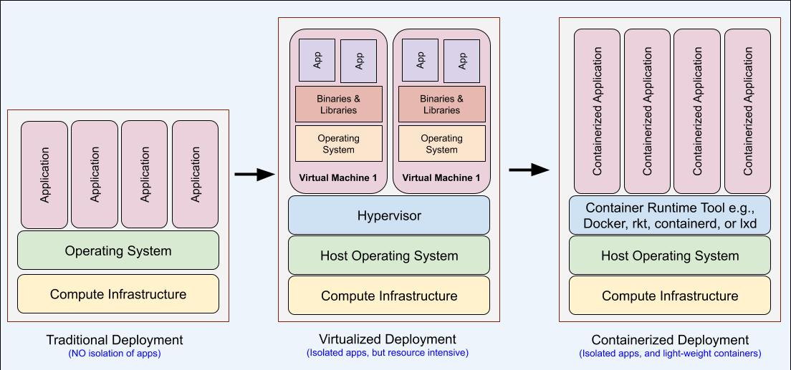

## What is Kubernetes?

Kubernetes (K8s) is an Apache 2.0-licensed open source Container Orchestration tool for effectively managing containerized applications. Remember, we read in the previous concept that a Container Orchestration tool groups containers of an application into multiple logical entities for easy management and discovery.

Kubernetes can automate the deployments, maintaining a logical group of containers, and helps to scale the application services. Google started it, but many other companies like Docker, Red Hat, and VMware contributed to it. In 2016, Google transferred the IP rights to Cloud Native Computing Foundation

## Why do we need Kubernetes?

Let us have a contrast comparison of application deployment methodologies to understand the need for Kubernetes. The figure below compares the Traditional, Virtualized, and Container-based deployments.



The above image shows the containerized applications have the advantage of being lightweight and more comfortable to manage, as compared to Virtual Machine (VM) based deployment. We have already learned the advantages of using Containers in the previous lesson. Kubernetes can help in managing containerized application in the following ways:

**Manage Containers**- Self-healing such as auto-restart of a backup/replica container in case of a failure, automate the rollouts and rollbacks, configuration management of containers
Autoscale Workloads and Load balancing - Distributing a load of network traffic to suitable container/node
**Optimal Resource Utilization** - Each container has its own resource (CPU and memory) requirements. Kubernetes fits a container to the most suitable Node so that the resources of the Node are utilized effectively.
**Service Discovery** - Provide native methods for service discovery
**Storage orchestration** - Automatically mounting the volumes to containers
**Others** - Fire off jobs and scheduled cronjobs, quickly integrate and support 3rd party apps, and manage Stateless and Stateful applications

## How does Kubernetes work?

A Kubernetes deployment follows the “Master-Worker” model. We need to understand the key components before we look into the architecture diagram.

**Node** - A physical or virtual machine that runs multiple containers belonging to an application.
**Cluster** - A set of Master and Worker Nodes. When we deploy Kubernetes, we get a cluster, which each cluster has a minimum of one worker node. A master node is capable of managing multiple worker nodes.
**Master Node** - A node that decides the pod scheduling, and pod replication. The main components of a master node are - “kube-api-server”, “kube-scheduler”, “kube-controller”.
Worker Node - A node on which pods are scheduled and run.
**Pod** - A group of tightly coupled containers with shared storage, network, and a specification for how to run the containers. All the containers in a Pod are co-located and co-scheduled. The worker node(s) hosts the pods.
The diagram below shows a Kubernetes cluster with all the components mentioned above.


In the above diagram, the following elements are involved:

**kubelet** - a “node agent” using which the worker node communicates with the master node. The kubelet runs on each Node.
**kube-proxy** - a “node agent” using which the worker node communicates with the external world. The kube-proxy also runs on each Node.
**kube-apiserver** - the frontend API that exposes the Kubernetes control plane.
**etcd** - a key-value store to stores the cluster state
**kube-scheduler** - a component that schedules the pods for running on the most suitable Node.
**kube-controller-manager** - a component that bundles and runs controller processes. These processes concern the nodes, replication, endpoints, and access management.

### kubectl commands

```
kubectl To display category-wise list all the commands and corresponding description
kubectl version To display the version of installed Kubernetes client and server
kubectl version --client To display the version of installed Kubernetes cluster
kubectl config current-context To display the configuration file name for the current context
kubectl get nodes To display the list of nodes along with their status, role, age, and version
kubectl get pods To display the list of containers in current namespace
kubectl get pods --all-namespaces To display all pods in all namespaces
kubectl cluster-info To display the cluster state. It returns a URL
```

## What is a Pod?

A pod is a "logical-grouping" of tightly coupled containers (one or more) that have shared storage, a network, and a standard specification. The worker node(s) hosts one or more pods at a time. The image below shows a pod having two containers running in a host.


The set of containers within a pod have the following essential characteristics:

- share the same namespace (IP address and ports), storage, and network.
- can communicate within the set using localhost
- behaves like a single entity.
- will always run on a single host node (co-located) until the service that they run is terminated. Then, it frees up the resources of the node.
- will always be scheduled together to run on a host node as a single entity (co-scheduled). If a container is shut down/added/removed, then the pod has to "restart". Here, the "pod restart" means to restart the environment the containers run in.
- uses Docker as the container runtime
- run a single instance of the containerized application. Multiple instances of the application (horizontal-scaling) can be created by running multiple pods, one for each application instance.
  A Controller helps to manage multiple pods each running an individual instance of the application.

## The Role of Controller

Assume there are multiple pods, each running an individual instance of the application. Such a set of identical pods is called ReplicaSet. The ReplicaSet (of pods) ensures the high-availability of the services hosted inside them. ReplicaSets are created and managed by Controller.

The Controller specifies the necessary attributes and state of Pods and ReplicaSets in a .yaml configuration file, which is called Deployment. This configuration file provides declarative updates to manage Pods and ReplicaSets. The Controller can manage the situations, such as when the host (worker-node) fails, or the pod scheduling is interrupted, using the "Deployment" configuration file. In such cases, the Controller automatically replaces the pod by scheduling an identical replacement on a different node.

## Deployments

In the previous concept, we learned that the Controller specifies the necessary attributes and state of Pods and ReplicaSets in a .yaml configuration file, which is called Deployment. This configuration file provides declarative updates to create and manage Pods / ReplicaSets. We define a Deployment to:

- create new Pods or ReplicaSets
- delete the existing Deployments, thereby releasing the compute resources occupied by them

A Deployment contains the details about the containers that would comprise the Pods / ReplicaSets.

```
apiVersion: extensions/v1beta1
kind: Deployment
metadata:
  labels:
    service: reverseproxy
  name: reverseproxy
spec:
  replicas: 2
  template:
    metadata:
      labels:
        service: reverseproxy
    spec:
      containers:
      - image: scheele/reverseproxy
        name: reverseproxy
        imagePullPolicy: Always
        resources:
          requests:
            memory: "64Mi"
            cpu: "250m"
          limits:
            memory: "1024Mi"
            cpu: "500m"
        ports:
        - containerPort: 8080
      restartPolicy: Always
```

Deploy it!

`kubectl apply -f reverseproxy-deployment.yaml`
See the running deployments:

`kubectl get deployment`
See the replica sets:

`get rs`
See the pods:

`get pod`
