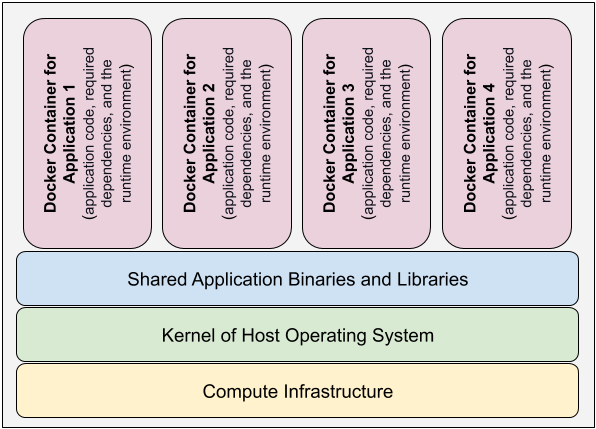

## Docker

Docker is a tool that helps to create "images". An "image" (or Docker image) is a portable package that contains the application and its dependencies. An "image" can be used to instantiate multiple "containers".

### What is a Container?

OS level virtualization allows us to run multiple isolated user-space instances in parallel. A "container" (or Docker container) is the isolated user-space instance that has the application code, the required dependencies, and the necessary runtime environment to run the application. In other words, all the containers running on a host behave like isolated processes in userspace. The image below explains the concept of multiple containers on a host.



### Benefit of Containers

- Docker images make it easier for developers to create, deploy, and run applications on different hardware and platforms, quickly and easily. Docker has become an essential tool in CI/- CD pipeline nowadays.
- Containers share a single kernel and share application libraries.
- Containers cause a lower system overhead as compared to Virtual Machines.
- Containers are platform independent.
- Containers are easy to manage as compared to Virtual Machines (VMs).

### Instructions to Create an Image from a Dockerfile

Let us start with creating a Docker file for "user" microservice. So, navigate to the udacity-c3-restapi-user directory.

#### Step 1. Install project dependencies

This project uses NPM to manage software dependencies. NPM relies on the package.json file located in the current directory.

`npm install`

#### Step 2. Create your Dockerfile

Create an empty file using the command `touch Dockerfile`. The Dockerfile does not have any file extension. Below is the content of `Dockerfile` that the instructor has created for the restapi-user endpoint:

```Dockerfile
# Set the base image
FROM node:12
# Create app directory
WORKDIR /usr/src/app
# Copy package.json AND package-lock.json
COPY package*.json ./
# Install all dependencies
RUN npm ci
# Copy the rest of the code
COPY . .
# Expose the port
EXPOSE 8080
# Define the command that should be executed
CMD [ "npm", "run", "dev" ]
```

#### Step 3. Build the Image for the "user" service

The `docker build` command builds images from a Dockerfile and a “context”. The following is the command example:

`docker build -t <your_dockerhub_username_lowercase>/udacity-restapi-user .`

The above command will create an image. You can see the list of all images using the following command:

`docker images`

#### Step 4. Build the image for the "feed" service

Navigate to the udacity-restapi-feed directory, and follow the Steps 1 to 3 again. The `Dockerfile` for the "feed" service would be the same as the one for "user" service. You would give a different name for "feed" image:

`docker build -t <your_dockerhub_username_lowercase>/udacity-restapi-feed .`

**Note:** Both the "feed" and "user" services are exposed at the same port 8080 (see Dockerfile). Therefore, only one of them can serve as of now. We can have both of them up and running when we configure Nginx reverse-proxy.

#### Step 5. Build the image for the "frontend" service

Navigate to the udacity-c3-frontend directory, and follow the Steps 1 to 3 again. The Dockerfile for the "frontend" service would be a different one, as follows:

```Dockerfile
## Build
FROM beevelop/ionic AS ionic
# Create the application directory
WORKDIR /usr/src/app
# Install the application dependencies
# We can use wildcard to ensure both package.json AND package-lock.json are considered
# where available (npm@5+)
COPY package*.json ./
RUN npm ci
# Bundle app source
COPY . .
RUN ionic build

## Run
FROM nginx:alpine
#COPY www /usr/share/nginx/html
COPY --from=ionic /usr/src/app/www /usr/share/nginx/html
```

You would give a different name for the "frontend" image:

`docker build -t <your_dockerhub_username_lowercase>/udacity-frontend .`

#### Optional Step

If you face any errors, please need to update the Angular dependencies. Try to update them before building the image as follows:

```
sudo npm install -g @angular/cli@latest
sudo ng update --all --force
docker build -t <your_dockerhub_username_lowercase>/udacity-frontend .
```

Your can see the list of generated images by using the following command:

`docker images`

If you want to remove any image, use the following commands:

```
docker image rm -f <image_name/ID>
docker image prune
```

## Important Terms

### Dockerfile

- a text file without any extension that contains all the commands to be executed to generate an image.

**FROM**

- a Dockerfile must begin with a FROM instruction . initializes a new build stage
- sets the base image for subsequent instructions

**RUN**

- command to create and start containers using the current image
- commits the results so that the resulting committed image will be used for the next step in the Dockerfile.

**WORKDIR**

- creates (if not exists) and set the working directory for any RUN, CMD, ENTRYPOINT, COPY and - - ADD instructions that follow it in the Dockerfile.

**COPY**

- copies new files or directories from <src> and adds them to the filesystem of the container at the path <dest>

**EXPOSE**

- specify the network ports of the container at runtime
- specify the network protocol that the port listens (TCP is the default)
- EXPOSE does not actually publish the port -- it functions more as a documentation tool

**CMD**

- provide defaults for an executing container
- if the defaults do not include an executable, you must specify an ENTRYPOINT
- NOTE: there can be only one CMD instruction in a Dockerfile

### Docker Commands

```
docker run --publish 8080:8080 --name feed <your_dockerhub_username_lowercase>/udacity-restapi-feed

docker container ls

docker container kill <container_name>

docker container prune

#Logs

docker logs feed

docker logs feed --follow

docker logs feed --tail 3

#Debug inside the container
docker exec -it feed bash

```

## Important Commands In Docker

### Containers

```
create— Create a container from an image.

start— Start an existing container.

run —  Create a new container and start it.

ps— List running containers.

inspect— See lots of info about a container.

logs— Print logs.

stop— Gracefully stop a running container.

kill —Stop the main process in a container abruptly.

rm— Delete a stopped container.
```

### Images

```
build— Build an image.

push — Push an image to a remote registry.

images — List images.

history  — See intermediate image info.

inspect  — See lots of info about an image, including the layers.

rm  — Delete an image.
```

### Docker registry

```
docker push yourdockerhubname/udacity-restapi-feed
```

## Docker Compose

Previously we read that when different backend services are running on the same port, then a reverse proxy server directs client requests to the appropriate backend server and retrieves resources on behalf of the client. The reverse-proxy server lies behind the firewall in a private network. The following are benefits of using a reverse-proxy server:

- It raises the security level for accessing the services only through the reverse-proxy server (encapsulation of services).
- It resolves the conflict between services running on the same port number in separate containers by directing the client requests to the appropriate backend server. The diagram below shows how the Nginx serves as a reverse-proxy server.


In this concept, we will learn about the basic configuration of Nginx reverse-proxy server. Here, we have a configuration file (nginx.conf) that will help us to associate the incoming request from Nginx to different servers. Once we have Nginx configured in place, we will use Docker-compose.

Docker Compose allows us to run applications with multiple containers. We'll use a YAML file to configure all of the services we need, then run a single command, to create and start all of the services. Follow the instructions below to use Nginx and Docker Compose.

### docker-compose-build.yaml

```yaml
version: "3"
services:
 reverseproxy:
 build:
 context: .
 image: your_dockerhub_username_lowercase/reverseproxy
 backend_user:
 build:
 context: ../../udacity-c3-restapi-user
 image: your_dockerhub_username_lowercase/udacity-restapi-user
 backend_feed:
 build:
 context: ../../udacity-c3-restapi-feed
 image: your_dockerhub_username_lowercase/udacity-restapi-feed
 frontend:
 build:
 context: ../../udacity-c3-frontend
 image: your_dockerhub_username_lowercase/udacity-frontend:local
```

### docker-compose.yaml

```yaml
version: "3"
services:
  reverseproxy:
    image: your_dockerhub_username_lowercase/reverseproxy
    ports:
      - 8080:8080
    restart: always
    depends_on:
      - backend-user
      - backend-feed
  backend-user:
    image: your_dockerhub_username_lowercase/udacity-restapi-user
    volumes:
      - $HOME/.aws:/root/.aws
    environment:
      POSTGRESS_USERNAME: $POSTGRESS_USERNAME
      POSTGRESS_PASSWORD: $POSTGRESS_PASSWORD
      POSTGRESS_DB: $POSTGRESS_DB
      POSTGRESS_HOST: $POSTGRESS_HOST
      AWS_REGION: $AWS_REGION
      AWS_PROFILE: $AWS_PROFILE
      AWS_BUCKET: $AWS_BUCKET
      JWT_SECRET: $JWT_SECRET
      URL: "http://localhost:8100"
  backend-feed:
    image: your_dockerhub_username_lowercase/udacity-restapi-feed
    volumes:
      - $HOME/.aws:/root/.aws
    environment:
      POSTGRESS_USERNAME: $POSTGRESS_USERNAME
      POSTGRESS_PASSWORD: $POSTGRESS_PASSWORD
      POSTGRESS_DB: $POSTGRESS_DB
      POSTGRESS_HOST: $POSTGRESS_HOST
      AWS_REGION: $AWS_REGION
      AWS_PROFILE: $AWS_PROFILE
      AWS_BUCKET: $AWS_BUCKET
      JWT_SECRET: $JWT_SECRET
      URL: "http://localhost:8100"
  frontend:
    image: your_dockerhub_username_lowercase/udacity-frontend
    ports:
      - "8100:80"
```

### Docker Compose Commands

```
docker container ls
docker container kill <container_name>
docker container prune
```

To see the list of running containers, run the command - docker-compose ps. You will see a list of container names, states, and ports listed.

Build the images for each of our defined services, using the command:
`docker-compose -f docker-compose-build.yaml build --parallel`

To start the system, run a container for each of our defined services, in the attached mode:
`docker-compose up`

Alternatively, you may use detached mode to run containers in the background:
`docker-compose up -d`

To stop container gracefully
`docker-compose stop`

To remove (and stop) the container
`docker-compose down`
